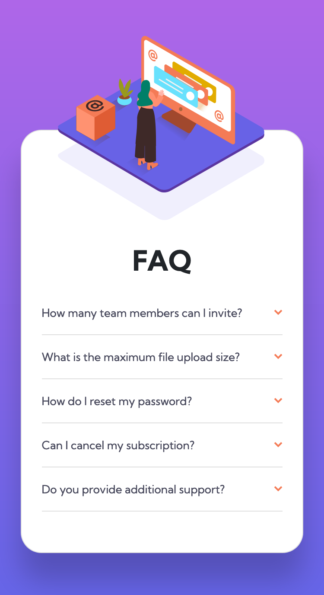
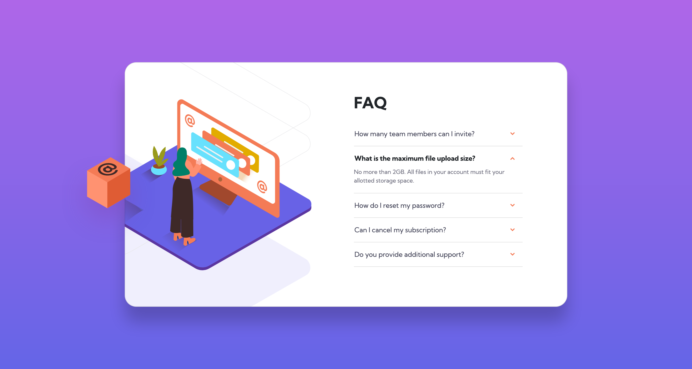

# Frontend Mentor - FAQ Accordion Card Solution

This is a solution to the [FAQ Accordion Card Challenge on Frontend Mentor](https://www.frontendmentor.io/challenges/faq-accordion-card-XlyjD0Oam). Frontend Mentor challenges help you improve your coding skills by building realistic projects. 

## The challenge
Users should be able to:

- View the optimal layout for the component depending on their device's screen size
- See hover states for all interactive elements on the page
- Hide/Show the answer to a question when the question is clicked

## Screenshot

### Mobile


### Desktop


## Built with
- Semantic HTML5 markup
- CSS custom properties
- CSS Grid
- Mobile-first workflow
- Bootstrap

## What I learned
This is my second attempt at this challenge. My first attempt was okay but I wasn't completely satisfied with the way the accordion items animated as they expanded and collapsed. This time I decided to use Bootstrap's accordion and I think it looks much better. This was my first time using Bootstrap and I can see how useful it is for quickly adding functioning components to a webpage. I did however spend quite a lot of time resetting and overwriting the styles that Bootstrap had applied on the accordion. However this was quite a useful exercise because it helped me get to grips with using FireFox's developer tools to identify which elements the styles were being applied to. For some reason Bootstrap likes to use a lot of `<div>` elements so I replaced as many as possible with more semantic elements like `<article>` and `<p>`.

I'm quite pleased with the way the images scale as the viewport width expands. For the mobile image I used a pseudo-element's `content` property to add the main image and applied a `background` on the pseudo element to add the shadow underneath:
```css
.card::before {
    content: url('images/illustration-woman-online-mobile.svg');
    position: absolute;
    top: -.1875rem;
    left: calc(50% - .0625rem);
    transform: translate(-50%, -50%);
    width: 73.5%;
    padding-bottom: min(7.25vw, 2rem);
    background: url('images/bg-pattern-mobile.svg') no-repeat center bottom / 100%;
}
```

And this pseudo-element transforms into the box image at the larger viewport which has a levitating animation:
```css
.card::before { 
        content: '';
        inset: min(8vw, 5.75rem) 3% 0;
        width: min(17.25vw, 12rem);
        background: url('images/illustration-box-desktop.svg') no-repeat center / 100%;
        animation: levitate 2s infinite alternate;
}
```

## Continued development
At the moment I'm quite interested in using Bootstrap just to build specific components of a webpage. I think in the next project I will use Boostrap to build the navigation menu, then perhaps I will download the Bootstrap files and create a page entirely with Bootstrap in conjunction with SASS.